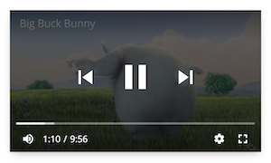

## VideoJS Plus

VideoJS Plus is an extension and skin for [video.js](https://github.com/videojs/video.js). <br>

### Base Usage

[Demo](https://pong420.github.io/videojs-plus/examples/)

### Advancaed Usage

#### An Electron frameless application


### Installation

```bash
npm install videojs-plus
# or
yarn add videojs-plus
```

### Usage

- Basic

```html
<html>
  <head>
    <link rel="stylesheet" href="videojs-plus.min.css" />
  </head>
  <body>
    <video id="example-video" class="vjs-fluid" poster="http://vjs.zencdn.net/v/oceans.png">
      <source src="http://vjs.zencdn.net/v/oceans.mp4" />
    </video>
  </body>
  <script src="http://vjs.zencdn.net/6.10.3/video.js"></script>
  <script src="videojs-plus.min.js"></script>
  <script>
    var player = videojs('example-video');
  </script>
</html>
```

- [Vue](./guide/Vue.md)

<br>

## Features

- [Title](./guide/Title.md)
- [Context Menu](./guide/ContextMenu.md)
- [Setting Menu](./guide/SettingMenu.md)
- [Mobile UI](./guide/Mobile.md)



- **Dimensions of controls**<br>
  You can change the dimensions of controls / menu by changing the `font-size` of `.video-js`. For example,

```css
.video-js {
  @media (min-width: 1440px) {
    font-size: 18px;
  }

  @media (min-width: 1680px) {
    font-size: 20px;
  }
}
```

- **FindChild** <br>
  A function that get player component. <br>
  For Example, you want to insert a button before `SettingMenuButton`.

```js
const { parent, component, index } = player.findChild('SettingMenuButton')[0];
parent.addChild(new Button(player), {}, index);

// whithou findChild
const ControlBar = player.getChild('ControlBar');
const index = ControlBar.children_.indexOf('SettingMenuButton');
ControlBar.addChild(new Button(player), {}, index);

// or
videojs.getComponent('ControlBar').prototype.options_.children = [
  //...
  'Button',
  'SettingMenuButton'
];
```

<br>

## Plugins

- [Autoplay](./guide/plugins/Autoplay.md)
- [Playlist](./guide/plugins/Playlist.md)
- [Subtitles](./guide/plugins/Subtitles.md)
- [Quality](./guide/plugins/Quality.md)
- [FullWindow Toggle](./guide/plugins/FullWindow.md)
- [Picture In Picture](./guide/plugins/PictureInPicture.md) ( Experimental )
- [Live](./guide/plugins/Live.md) ( Style plugins for live streaming )

<br>

## Tips

- language <br>
  You can change the language of setting / context by [VideoJS language feature](https://docs.videojs.com/docs/guides/languages.html). For example

```js
const language = "zh-hk";

videojs("example-video". {
  language
})

videojs.addLanguage(language, {
  Speed: "速度",
  Normal: "正常"
});
```

<br>

## License

See [Apache 2.0](LICENSE).
