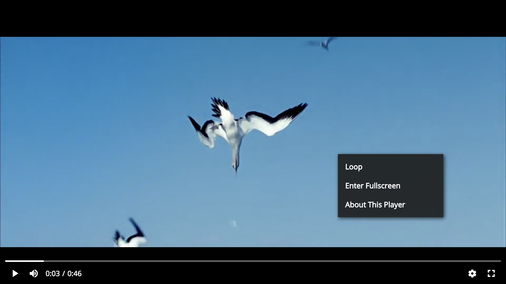

## Context Menu



#### Example for adding a contextmenu item

```js
const ContextMenuItem = videojs.getComponent("ContextMenuItem");

class ContextMenuCopyURL extends ContextMenuItem {
  constructor(player) {
    super(player, {
      name: "CopyVideoURL", // component name, optional
      label: "Copy video URL",
      icon: "vjs-icon-xxxx" // videojs icon classname, optional
    });
  }

  handleClick() {
    console.log("copied");
  }
}

player.getChild("ContextMenu").addChild(new ContextMenuCopyURL(player));
```
