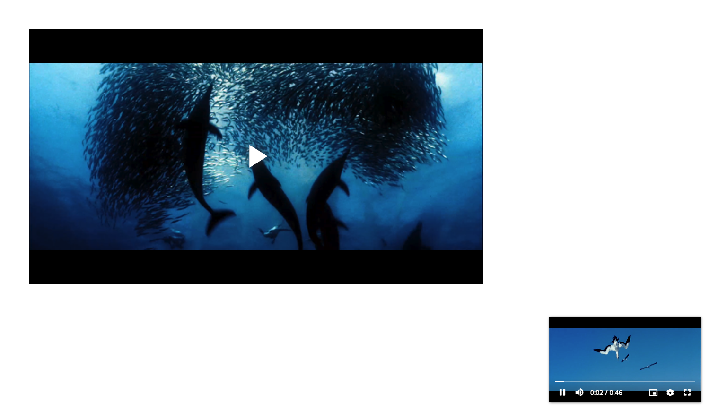

## Picture In Picture



[Demo](https://pong420.github.io/videojs-plus/examples/picture-in-picture.html)

#### Usage

```html
<link rel="stylesheet" href="videojs-plus-picture-in-picture.min.css">

<script src="videojs-plus.min.js"></script>
<script src="videojs-plus-picture-in-picture.min.js"></script>
```

#### API

```js
// show Mini player
player.pictureInPicture().init();

// dispose Mini player
player.pictureInPicture().dispose();

// toggle Mini player
player.pictureInPicture().toggle();

// update position of Mini player
player.pictureInPicture().updatePosition({
  x: 20, // css style left
  y: 20 // css style bottom
});
```

#### Plugin Options

> config must define before calling `init()`

- wrapper<br>
  You can define a custom wrapper for Mini player so you the position can be handled by yourself

```js
player.pictureInPicture({
  wrapper: document.querySelector(".custom-pip-player-wrapper")
});
```

- draggable <br>
  You can disable draggable of MiniPlayer

```js
player.pictureInPicture({
  draggable: false
});
```
