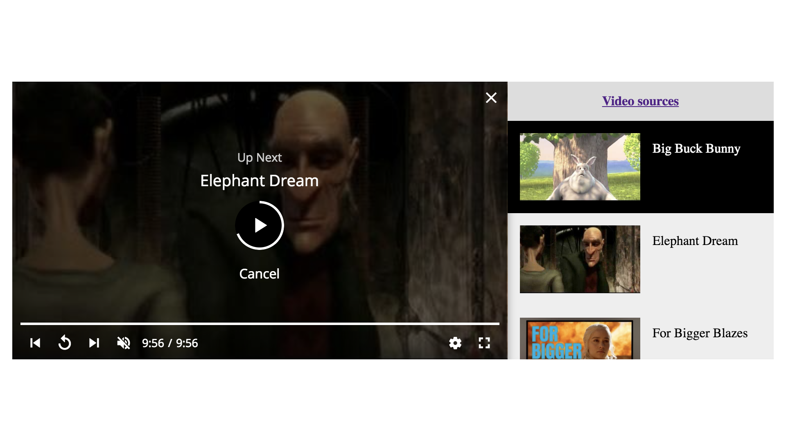

## Playlist

The playlist UI at the right hand side need to created by yourself




[Demo](https://pong420.github.io/videojs-plus/examples/playlist.html)

#### Usage

```html
<link rel="stylesheet" href="videojs-plus-playlist.min.css">

<script src="videojs-plus.min.js"></script>
<script src="videojs-plus-playlist.min.js"></script>
```

```js
const videos = [
  {
    source: [
      {
        src: "some.mp4",
        type: "video/mp4"
      }
    ],
    title: "some title",
    poster: "some poster"
  }
  //....
];

// set playlist in options
const player = videojs("example-video", {
  playlist: videos
});

// or
player.setPlayList(videos);

// switch video
player.playlist.pick(1);

// get current video
player.playlist.current();

// get current video index
player.playlist.index();

// get playlist
player.playlist.values;

// loop playlist, default true
player.playlist.loop(false);

// events
player.on("playlist", function() {
  console.log("playlist setup");
});

player.on("playlistchange", function() {
  console.log("playlist changed");
});
```
